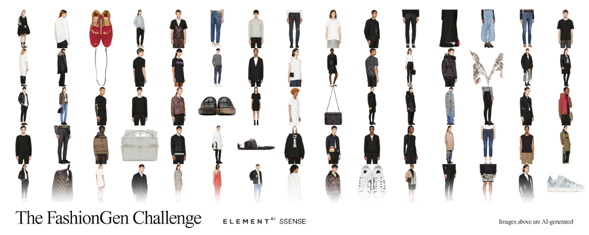
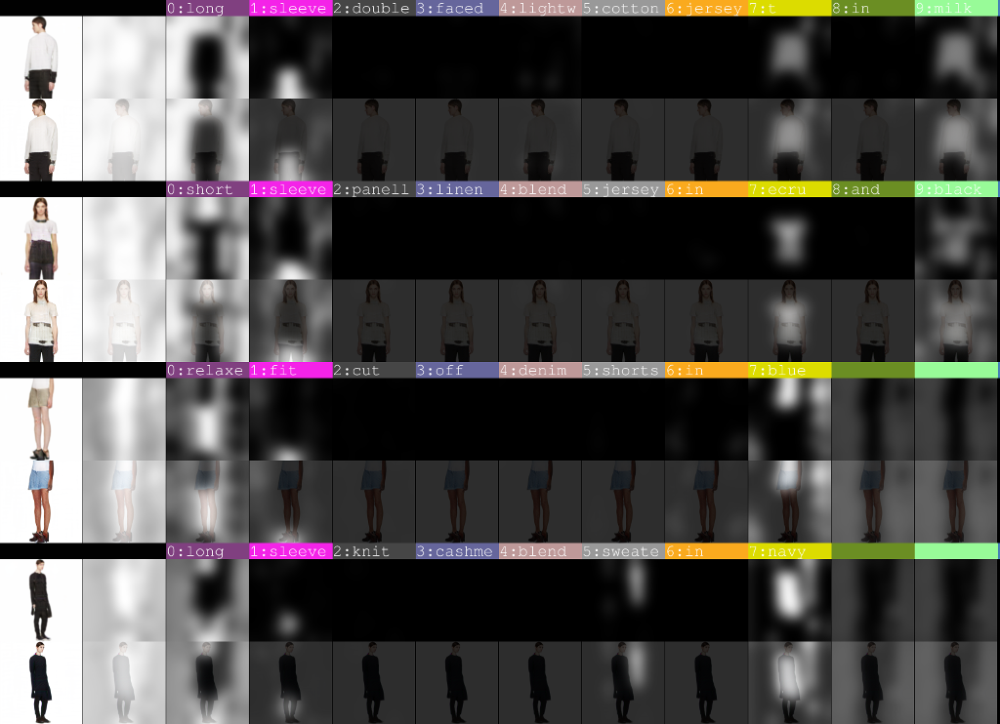

# Fashion-Gen Dataset

[Fashion-Gen: The Generative Fashion Dataset and Challenge](https://arxiv.org/abs/1806.08317) by Negar Rostamzadeh, Seyedarian Hosseini, Thomas Boquet, Wojciech Stokowiec, Ying Zhang, Christian Jauvin, Chris Pal.

# AttnGAN
Forked from https://github.com/taoxugit/AttnGAN  

Pytorch implementation for reproducing AttnGAN results in the paper [AttnGAN: Fine-Grained Text to Image Generation
with Attentional Generative Adversarial Networks](http://openaccess.thecvf.com/content_cvpr_2018/papers/Xu_AttnGAN_Fine-Grained_Text_CVPR_2018_paper.pdf) by Tao Xu, Pengchuan Zhang, Qiuyuan Huang, Han Zhang, Zhe Gan, Xiaolei Huang, Xiaodong He. (This work was performed when Tao was an intern with Microsoft Research). 

### Dependencies
python 2.7

Pytorch

In addition, please add the project folder to PYTHONPATH and `pip install` the following packages:
- `python-dateutil`
- `easydict`
- `pandas`
- `torchfile`
- `nltk`
- `scikit-image`

### Data

Download the [fashiongen](https://fashion-gen.com) image data. Extract them to `data/fashiongen/`.  

### Training
- Pre-train DAMSM models:
  `python pretrain_DAMSM.py --cfg cfg/DAMSM/fashiongen2.yml --gpu 0`
 
- Train AttnGAN models:
  `python main.py --cfg cfg/fashiongen2_attn2.yml --gpu 0`

`fashiongen2.yml` config file will train only on 7 categories (representing 61% of the dataset). To train on the complete dataset use `fashiongen.yml`.  

Training with `fashiongen2.yml` on one `NVidia GTX1070 Ti` GPU takes 8 hours per epoch with the default settings.  

### Examples generated by AttnGAN

Below, a generated image after 51 epochs of training  with `fashiongen2.yml` config file.  More epochs of training would be required to get more realistic results.  

### Fashion-Gen Specific code

In addition to the two config files in the `cfg` folder, you will find code specific to the fashion-gen dataset in the `code` folder. The main file is `dataset_fashiongen2.py` and the various Jupyther Notebook files to explore the dataset.  

